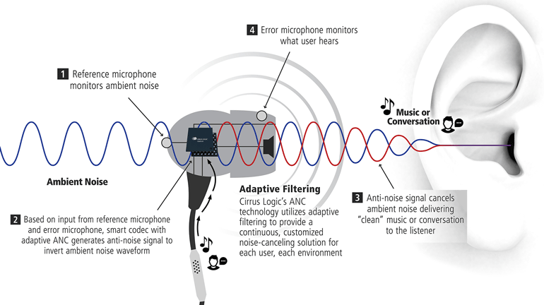

# Active Noise Cancellation Filtering Algorithms

## Overview

Active Noise Cancellation or Active Noise Control (ANC) is a technique for reducing the impact of unwanted sound within a system. Recently the Apple AirPods released a version including ANC. The goal is to filter out outside sound and instead allow a user of the system to focus on the desired or target signal.

A basic ANC system can be modeled like the following 

   
*Fig. 1: Graphic Credit: Cirrius Logic*

A few important pieces to highlight:
- There are two microphones in this type of ANC system. An error microphone that monitors what the user hears and a reference microphone that monitors for unwanted noise
- Anti-noise or anti-phase signals are the basis of ANC. By leveraging the microphones, an ANC can use algorithms that generate an anti-phase signal combined with the original signal. The combination of the two signals generates a descructive or cancellation effect and the remaining signal is the target or desired signal.

## Diminish Algorithms
In the early days Diminish supported multiple filtering algorithms leveraging an excellent Python library - [padasip](http://matousc89.github.io/padasip/). Diminish tested [Least Means Squared](https://en.wikipedia.org/wiki/Least_mean_squares_filter) which is a standard implementation for Active Noise Cancellation due to its ease of implementation and speed. Unfortunately LMS suffers issues when trying to converge upon the target signal. Diminish in turn tried [Normalized Least Means Squared](https://en.wikipedia.org/wiki/Least_mean_squares_filter#Normalized_least_mean_squares_filter_(NLMS)) and [Normalized Sign-sign Least Means Squared](https://matousc89.github.io/padasip/sources/filters/nsslms.html)

Ultimately all those filters did not converge quickly or provide stability within the Diminish use cases. The algorithm that was eventually successful was [Recursive Least Squares](https://en.wikipedia.org/wiki/Recursive_least_squares_filter) which has been proven to be far more stable than other filtering mechanisms within the ANC field. Unfortunately RLS suffers from a high computational complexity compared to LMS. This led to the decision to use a more powerful computer as the primary algorithm processing unit. See [Architecture](architecture.md) for additional details on the final setup.

During the build phase, Diminish determined as well that Python was too slow to perform the necessary filtering in real time. This led to the creation of [external C libraries](libraries.md) proving an order of magnitude faster and supporting real time use cases. Diminish still has the code architecture to support alternative filtering algorithms but currently RLS is the only implemented version in C.